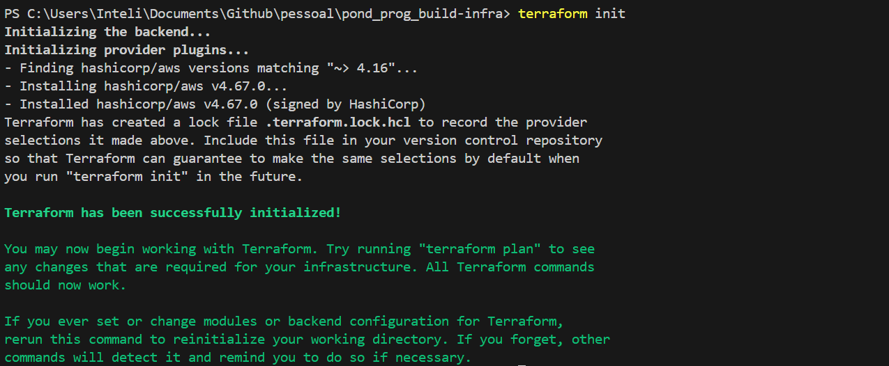

# **Provisionamento de Infraestrutura com Terraform na AWS**
Este repositório documenta o processo de automação da criação de infraestrutura na AWS utilizando Terraform, seguindo as boas práticas de *Infrastructure as Code (IaC)*. O procedimento foi baseado no tutorial oficial da HashiCorp.

## **1. Preparação do Ambiente**

### **1.1 Instalações Necessárias**

Para iniciar o projeto, foram instaladas as seguintes ferramentas:

- [Terraform](https://developer.hashicorp.com/terraform/tutorials/aws-get-started/install-cli)  
- [AWS CLI](https://docs.aws.amazon.com/cli/latest/userguide/getting-started-install.html)

### **1.2 Configuração das Credenciais da AWS**

Como as credenciais foram obtidas por meio do ambiente **AWS Academy**, foi necessário utilizar chaves temporárias. Para isso:

- Criei o arquivo `variables.tf` para definir as variáveis de entrada:

```bash
variable "access_key" {}
variable "secret_key" {}
variable "session_token" {}
variable "region" {}
```

- Em seguida, criei o arquivo `terraform.tfvars` com os valores correspondentes:

```bash
access_key    = "SEU_ACCESS_KEY"
secret_key    = "SEU_SECRET_KEY"
session_token = "SEU_SESSION_TOKEN"
```

Obs.: O Terraform utiliza automaticamente essas variáveis no momento da execução.

## **2. Provisionamento da Infraestrutura**

### **2.1 Definição do Arquivo `main.tf`**

O arquivo `main.tf` contém a configuração do provedor e o recurso a ser criado (instância EC2):

```bash
provider "aws" {
  region     = var.region
  access_key = var.access_key
  secret_key = var.secret_key
  token      = var.session_token
}

terraform {
  required_providers {
    aws = {
      source  = "hashicorp/aws"
      version = "~> 4.16"
    }
  }

  required_version = ">= 1.2.0"
}

resource "aws_instance" "app_server" {
  ami           = "ami-830c94e3"
  instance_type = "t2.micro"

  tags = {
    Name = "ExampleAppServerInstance"
  }
}
```

### **2.2 Inicialização do Projeto**

O ambiente Terraform foi inicializado com o comando:

```bash
terraform init
```


### **2.3 Validação da Configuração**

Foi realizada a validação do código para garantir sua consistência:

```bash
terraform validate
```


### **2.4 Aplicação**
A aplicação do plano foi feita com:

```bash
terraform apply
```


Após revisar as alterações propostas, confirmei a execução digitando `yes`.


## **3. Verificação dos Recursos Criados**

### **3.1 Listagem dos Recursos no Estado**

Para listar todos os recursos gerenciados pelo Terraform:

```bash
terraform state list
```


### **3.2 Exibição Detalhada dos Recursos**

Para visualizar os detalhes da infraestrutura criada:

```bash
terraform show
```


### **3.3 Verificação no Console da AWS**
Além dos comandos Terraform, também verifiquei a criação da instância diretamente no AWS Console.

- Instância EC2 executando


- O Arquivo com o [log da instância](docs/instancia_aws.log) se encontra em: `docs/instancia_aws.log`.

## 4. Conclusão
A utilização do Terraform para provisionar infraestrutura na AWS oferece uma abordagem moderna, eficiente e escalável para gerenciar recursos em nuvem. Ao adotar a infraestrutura como código (IaC), torna-se possível automatizar processos, minimizar erros manuais e garantir a consistência entre diferentes ambientes.

Este pequeno exemplo prático demonstrou, de forma simples, como é viável criar recursos com controle total sobre suas configurações, mantendo rastreabilidade e facilitando futuras modificações.